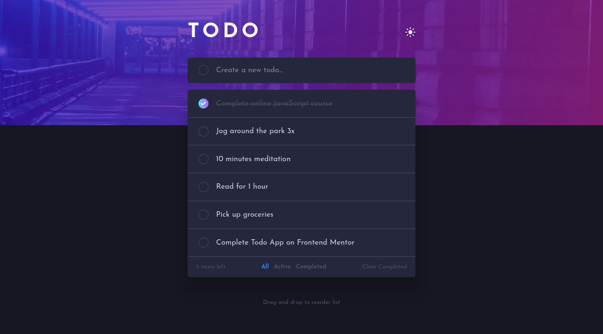
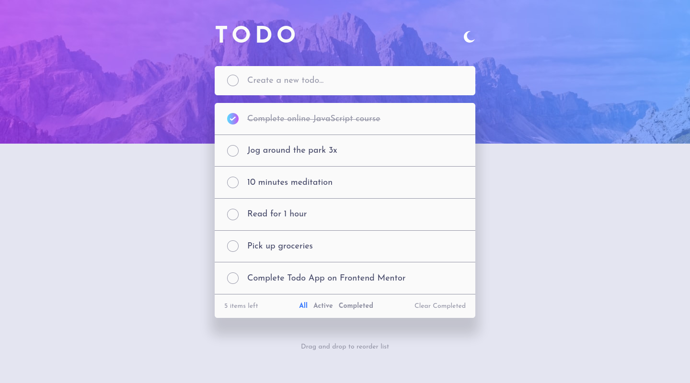
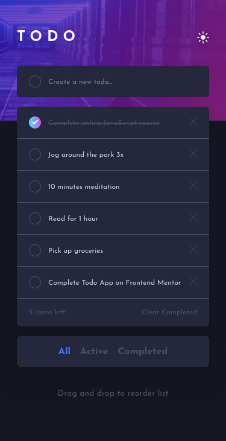
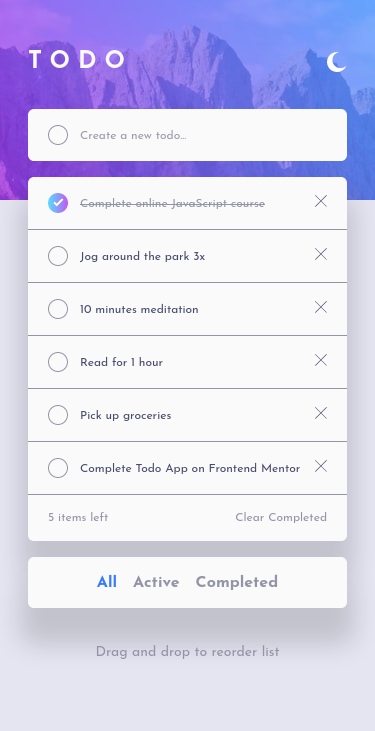

# Frontend Mentor - Todo app solution

This is a solution to the [Todo app challenge on Frontend Mentor](https://www.frontendmentor.io/challenges/todo-app-Su1_KokOW). Frontend Mentor challenges help you improve your coding skills by building realistic projects.

## Table of contents

- [Overview](#overview)
  - [The challenge](#the-challenge)
  - [Screenshot](#screenshot)
  - [Links](#links)
- [My process](#my-process)
  - [Built with](#built-with)
  - [What I learned](#what-i-learned)
  - [Continued development](#continued-development)
  - [Useful resources](#useful-resources)
- [Author](#author)

## Overview

### The challenge

Users should be able to:

- View the optimal layout for the app depending on their device's screen size
- See hover states for all interactive elements on the page
- Add new todos to the list
- Mark todos as complete
- Delete todos from the list
- Filter by all/active/complete todos
- Clear all completed todos
- Toggle light and dark mode
- **Bonus**: Drag and drop to reorder items on the list

### Screenshot






### Links

- Solution URL: [FrontendMentor Solution URL]()
- Live Site URL: [Github Pages URL](https://loganf50.github.io/todo-app/)

## My process

### Built with

- CSS Grid
- Flexbox
- Mobile-first workflow
- TypeScript
- [React](https://reactjs.org/) - JS library
- [Styled Components](https://styled-components.com/) - For styles

### What I learned

- drag and drop
- using '!' to tell TypeScript object will not be undefined (don't know if this is good to use or not):

```js
const dropTodo = todos.find((todo) => todo.id === id)!;
```

### Continued development

- drag and drop
  - would like to refine this as it seems very picky about where to be when dropping a todo but as far as I can tell it works

### Useful resources

- [Drag and Drop](https://dev.to/colinmcd01/drag-drop-re-ordering-using-html-and-react-974) - This helped me as it was my first time using drag and drop.

## Author

- Frontend Mentor - [@LoganF50](https://www.frontendmentor.io/profile/LoganF50)
